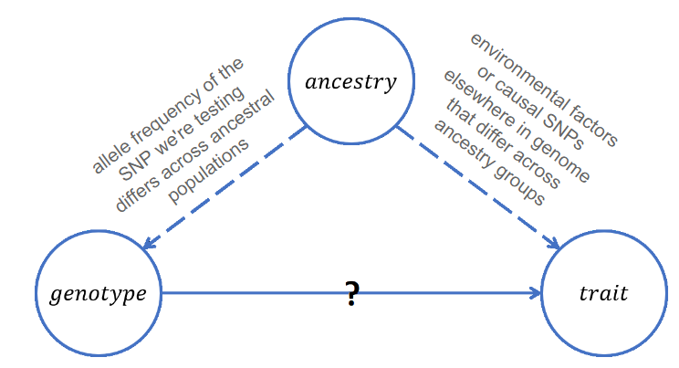
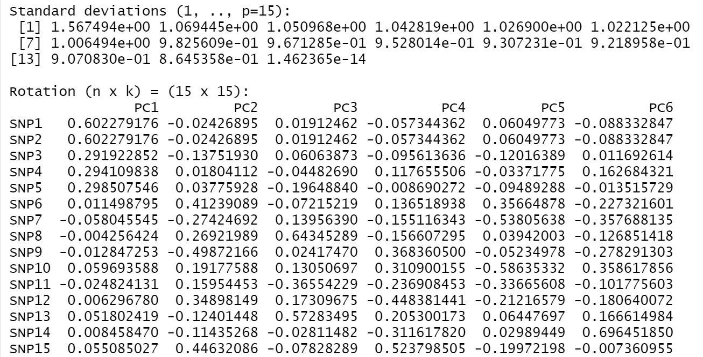
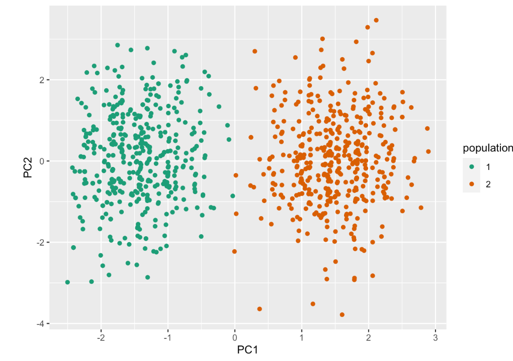

# Ancestry {#ancestry}

## Intro

Another cool aspect of genetics is ancestry. As generation passes, each
individual may carry similar but still different genetic ancestral
composition as their families (like hybrids). Some genetic companies
(i.e. 23andMe) sell kits for customers to learn more about their
genetics, both health wise and ancestry wise.

So how does this area apply to statistical genetics? Well, ancestry has
its connection with GWAS. Besides, scientists can apply mathematical
methods to better infer one's ancestry by machine learning, in other
words, we can guess estimation of one's origin!

## Ancestry can be a confounder in GWAS

GWAS analyzes the statistical association between SNPs and our trait of
interest. In observational studies, ancestry can actually be a
confounder of GWAS. Confounder is a variable that both associates with
the predictor and the response variable.

People with different ancestry can have very different performance on
genotype: for example, for a SNP, people with European ancestry may have different allele
frequencies and different distribution of alleles compared to people with Asian ancestry.
Ancestry may also associate with the trait. Therefore, if we do not
stratify and control for the confounding variable, we may end up having
a spurious outcome in GWAS. This concept is especially important to keep
in mind when carrying out *observational studies*.

After adjusting for ancestry, our GWAS model (marginal regression) would
look like:

$$
E[y|x_j,A] = \beta_0 +\beta_j x_j+\gamma A
$$

where:

-   y is the trait

-   $x_j$ is the number of minor alleles at position j

-   A is the genetic ancestry

-   repeat for all positions j = 1, ..., p

However, what should we do when we do not have information on ancestry
for a particular data set? Then, we have to infer their ancestry, and
here is how powerful PCA is.

## An essential approach with inferring ancestry: Principal Component Analysis

What do we do when we do not know one's ancestral decomposition? Well,
luckily, after analyzing many individuals' ancestral and making them
into a huge database, statisticians can utilize previous knowledge and
make guesses on an individual's ancestry even though it is unknown. How
do we achieve this? One of the essential, and popular methods to analyze
such problems is to use Principal Component Analysis, short for PCA.

PCA is a machine learning algorithm, which can predict outcomes for new
data, using information we gained from previous data.

Here are some important key highlights about PCA:

1.  It is a technique to reduce the complexity of high dimensional data
    to low dimensions by "summarizing the variables", achieved by
    expressing **principal components (PCs)** in terms of linear
    combination of predictors.
2.  The criteria for determining the expression of PCs is to choose the
    one which maximizes the variation of the variable values. Therefore,
    this technique is called "dimension reduction" since we have fewer
    dimensions from variables.
3.  It is called an *unsupervised* algorithm, meaning there is no
    response variable we are interested in, instead, we want PCA tells
    us how my distribution of data looks like by forming some clustering
    groups.

Here is a youtube [video](https://www.youtube.com/watch?v=x4_XTBoxr3Q)
explains PCA very well (adapted from Prof. Leslie Myint).

> For your interest and better understanding of PCA conceptually, here
> is a link to a [discussion
> forum](https://stats.stackexchange.com/questions/2691/making-sense-of-principal-component-analysis-eigenvectors-eigenvalues/140579#140579)
> to analog PCA concepts with characteristics in wines!

### What is beneficial and special about PCA?

Recall from last section where we mention that ancestry may be a
confounder in GWAS: since PCA captures the information that summarizes
ancestry information,we can include them in our analysis easily just as
adding a linear term to the original marginal regression model (but this
is just for ONE SNP!).

$$
E[Y|X_j,PC_1,PC_2]=\beta_0+\beta_1x_j+\beta_2PC_1+\beta_3 PC_2+...
$$

By PCA, we can efficiently and effectively replace the predictors we
have with new variables (PCs). In other words, we can create fewer, new
variables that help us capture all the traits from our samples. Since
the PCs are linear combination of the old predictors, the PC will look
like:

$$
PC_1 = a_{11}x_1+a_{12}x_2+...+a_{1p}x_p\\
$$
$$
PC_2 = a_{21}x_1+a_{22}x_2+...+a_{2p}x_p\\
...\\
$$

$$
PC_p = a_{p1}x_1+a_{p2}x_2+...+a_{pp}x_p\\
$$

*Note*: $PC_1$ ALWAYS explains the most variability in our data:
considering all possible linear combinations; $PC_2$ ALWAYS explains the
second most variability in the data; same as $PC_3$. The variance
explained by PC decreases with further PCs.

The amazing thing about PCA here is that the algorithm automatically
clusters the data into different dimensions, allowing us to see patterns
very easily. In this context, the "patterns" mean **genetic ancestry**!
For an exemplar visualization, here is a figure from the paper "Genes
mirror geography within Europe." ([Novembre et al.,
2008.](https://www.nature.com/articles/nature07331))

> The cited paper mainly characterized 3000 European individuals
> genotyped at lots of DNA sites to find out patterns of their
> population structure. The letters in the figure recorded their
> reported geographic information.

#### PCA Vocab

After learning what PCA is, there are some terms you should know for PCA
as well!

-   **Score**: The value for an observation to have for PC.

-   **Loadings**: The coefficients $a_{11},a_{22},...a{pp}$. They can be
    either positive or negative, for sure. The loadings tell you the
    contribution of each original variables to the PC (take the absolute
    value of the loadings, the greater it is, the more weight this PC
    takes this variable in concerns).

-   **Variance explained**: The variability of the whole data a PC
    captures. This decreases with subsequent PCs.

That's it!

## Lab: Applying PCA

You've come to a lot of understanding of our work today! In this
section, we will take a look at what PCA results look like and explore
their meanings.

### Understand PCA output

Here is a screenshot from my PCA analysis demo. I have 15 SNPs (SNP
1-15). Can you see how many PCs do we have? What do numbers in each
column mean?

Summary:

1.  There are 15 PCs for our data set.

2.  The "standard deviation" column explains the variability (more
    specifically, standard deviation is the sqaure root of variance
    explained) each PC captures. PC1 has the greatest standard as we
    expect, it decreases with the sequence.

3.  The "rotation" column are the loadings. For example, in PC1, the
    most important variables are SNP 1 and SNP2 because they share the
    most absolute value of the loadings (since PC1 captures the most
    variability, it indicates that SNP 1 and SNP 2 contribute to it very
    much!!). This picture only captures loadings from PC1 to PC6.

### PC score visualization

Let's create plot showing the score for the top PCs: PC1, 2. to
visualize data patterns. What do you learn from this plot?

The magic of PCA shows that even if we have no knowledge about the
ancestry, PCA automatically grouped them by the PCs. It seems like we
have a pattern between two population groups (mainly by PC1, that is
where the score differs the most across two groups).

However, given this strong and powerful algorithm, PCA results sometimes
still get its own limitations. Since an individual's genotype may depend
on their ancestry, people with mixed ancestry inherit different genetic
materials from their parents (or grandparents), therefore, for some SNPs
they may carry differently. If we were to carry out PCA on this group of
people, we need to more carefully intepret the results.

The topic about "alleles' narrative potential" is also important, or,
problematic in GWAS and ancestry studies. For example, in biology, there
are situations where one type of allele may functionally outdo the other
one, and resulting different phenotypic traits in them (*complete
dominance*). There are also concepts in biology such as *multiple
alleles, incomplete dominance, codominance*. Therefore, when we carry
out GWAS and adjusting for ancestry, we may or may not intepret their
genotype the same way, thus posing a challenge for researchers to
understand the results fully and correctly.

## Outro

We briefly explored a widely-used method for inferring ancestry: PCA.
We've seen how ancestry can be a potential confounder in our GWAS
analysis, and the way we should address this problematic factor is to
include them into the model by adding PC elements. In real life study,
researchers have also been using this technique to group elements,
shrinking variables, and effectively learn information from a huge data
set.
