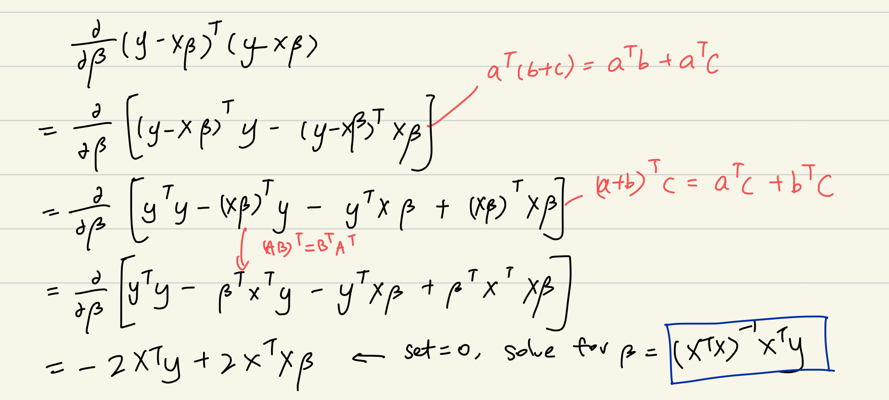
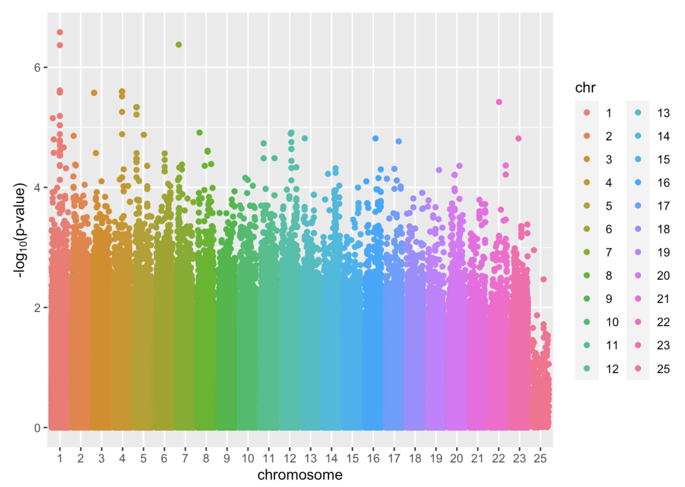

# Genome-wide Association Studies (GWAS) {#gwas}

## What is GWAS?

GWAS is a statistical approach to analyze the association of genetic variations and our trait of interest. There are many types of variation in genetics world, but SNP, also known as single- nucleotide polymorphism, is the most common type of genetic variation across many organisms, including us. Here is some nice introduction to SNP:

> "Single nucleotide polymorphisms, frequently called SNPs (pronounced"snips"), are the most common type of genetic variation among people. Each SNP represents a difference in a single DNA building block, called a nucleotide. For example, a SNP may replace the nucleotide cytosine (C) with the nucleotide thymine (T) in a certain stretch of DNA. SNPs occur normally throughout a person's DNA. They occur almost once in every 1,000 nucleotides on average, which means there are roughly 4 to 5 million SNPs in a person's genome. These variations occur in many individuals; to be classified as a SNP, a variant is found in at least 1 percent of the population. Scientists have found more than 600 million SNPs in populations around the world."
>
> --- <https://medlineplus.gov/genetics/understanding/genomicresearch/snp/>

In the context of GWAS, we are therefore investigating the relationship between the SNPs and the outcome (quantitative or qualitative traits). We can picture one SNP being a position along the genome where different people may carry different versions of nucleotide (building block of genes). Given the huge size of our genome, there are so many SNPs we can look for, and remember, each of them can be a single predictor.

## the p \>\>\>\>\>\> n problem!

Now, given that we have some basic understanding to GWAS, let's understand it deeper from a statistician's point of view. If we were given a set of SNP data, each SNPs should takes up a column, and each person's data should be in each row. So what are the data? Now, recall the concept of SNP. The majority of the SNPs are biallelic, meaning there are two common, major alleles (versions of nucleotide) one random person may take with them. I will use an example to illustrate this point.

> As for one SNP, there are two alleles: A and G. Each person inherits one allele from each parent. Then a person could have four possible genotypes (information about their alleles): AA, AG(mom = A, dad = G), GA(mom = G, dad = A), GG In real world, the genotype AG/GA does not matter much. Therefore we technically have three possible genotypes. We will denote a person's information at the SNP with level factors: 0, 1, 2. This records how many minor allele copy one has. Therefore, in this example, let's say if A is the major allele and G is the minor allele, then a person with the genotype AA will be given "0" in that SNP variable; AG will be given "1"; GG will be "2". An example of GWAS data would look like this:

|          | SNP1 | SNP2 | SNP3 | SNP4 | Body Weight (kg) |
|----------|------|------|------|------|------------------|
| Person1  | 0    | 0    | 1    | 0    | 59.2             |
| Person2  | 0    | 2    | 1    | 1    | 46.9             |
| Person3  | 1    | 0    | 1    | 0    | 64.5             |
| Person4  | 2    | 0    | 2    | 0    | 72.8             |
| Person5  | 0    | 1    | 0    | 2    | 71.3             |
| Person6  | 0    | 1    | 0    | 0    | 44.5             |

: A simple GWAS data frame

Therefore, in GWAS, it is more likely to be more predictors than observations (p\>\>n), creating a thin, but wide data frame. This p\>n fact will lead us some problems, not only in terms of difficulty to carry out statistical regression analyses, but also about the accuracy of our tests due to multiple testing.

One of the biggest themes in GWAS is the problem about multiple testing. Multiple testing is in its core problematic since the threshold where we define p-value with our hypotheses ($H_0$ and $H_A$) should be lowered. We will talk about this later in this topic.

## GWAS analysis methods

After hearing about all these introductions, we now will introduce two ways (and one of them, failed, actually) to investigate GWAS. The first method is to fit linear regression, and we will understand why it does not work from matrix perspective. Then, we will explore the second method: marginal regression, which fit each linear regression model with respect to one predictor at a time.

### Method 1: Matrix

When consider linear model with such huge data, it is always easier to formulate the data into three matrices. First, the vector of outcomes $\mathbf{y}$

$$
\mathbf{y} = \begin{pmatrix} y_1 \\ y_2 \\ \vdots \\ y_n \end{pmatrix},
$$

Second, the vector of covariates $\boldsymbol\beta$

$$
\boldsymbol\beta = \begin{pmatrix} \beta_0 \\ \beta_1 \\ \vdots \\ \beta_p \end{pmatrix},
$$

Lastly, the matrix of covariates (sometimes referred to as the "design matrix") $\mathbf{X}$

$$
\mathbf{X} = \begin{pmatrix} 1 & x_{11} & \cdots & x_{p1} \\ 1 & x_{12} & \cdots & x_{p2} \\ \vdots & \vdots & \ddots & \vdots \\ 1 & x_{1n} & \cdots & x_{pn} \end{pmatrix}.
$$

If we want to get the estimation for the best fit of linear regression model, we want to minimize the sum of squared residuals. Using matrix notation, we can formulate the least squares problem as follows:

$$\text{argmin}_{\boldsymbol\beta} (\mathbf{y} - \mathbf{X}\boldsymbol\beta)^\top(\mathbf{y} - \mathbf{X}\boldsymbol\beta),$$

If we want to know the $\beta$ which minimizes the expression above, one way is to differentiate the expression with respect to $\beta$. And we set that derivative to 0 to solve for $\beta$. Here is an example of my work.



Now, we get the expression of $$\hat{\boldsymbol\beta} = (\mathbf{X}^\top \mathbf{X})^{-1}\mathbf{X}^\top\mathbf{y}.$$ But in fact, $\beta$ is undefined. Why?

**Answer:** Recall the dimension of matrix $X$, it is $n*(p+1)$, where n is the number of observation and p is the number of SNPs. The matrix $X$ has more columns (p) than its row, and therefore, the columns are linearly dependent. And thus, $\mathbf{X}^\top \mathbf{X}^{-1}$ is not defined. Thus, we cannot find the coefficient $\beta$ for this equation.

To conclude, we failed to fit GWAS data into one linear model. However, there is a second method that works out in fact, which is **Marginal Regression**.

### Method 2: Marginal Regression

From above, we saw that if we were to fit a linear regression line on our y trait versus all the predictors (all the SNPs), we will fail to do so since the matrix $X^{T}X$ will not be invertible in most of the cases, and therefore failed to calculate the coefficient matrix. (The reason is that we have more co-variates/ number of columns than observations/number of rows, so $X^{T}X$ is not full *rank*, meaning the span cannot fit into the columns and this results an invertible matrix)

However, there is an alternative way to get around this constraint. Instead of fitting all SNPs into one model, what about fitting one for each SNP? And, you are right, this method does allow us for more flexibility with GWAS, and this method is **Marginal Regression**.

We can define a marginal regression as follows: $$E[y | x_j] = \beta_0 + \beta_1 x_j$$

where $\beta_0$ is the intercept, $x_j$ is the number of copy of minor alleles at the position j (the SNP). Then, if we were to interpret $\beta_1$, it would mean "the change in the average of y as we increase one copy of minor allele at $j$th position".

Why this method works then?

This has to do with linearly dependency in linear algebra. If we were to look into what matrix $X$ for each of the SNPs looks like, it only has two columns now: the first column with all 1's (serves as a placeholder for the intercept), and the second column with SNP data (0s, 1s, 2s). Therefore, unless everyone in the group has exactly same genotype (all 0s, all 1s, all 2s), where the columns of X are linearly dependent, $X$ will be linearly independent and therefore we can predict the coefficients easily by regression.

Given this concept, it seems like we are happy with everything. However, there is one case when this method still does not apply for. Do you know? *Hint: when is matrix X linearly dependent with each other. If we only have two columns, and one of them is just 1's, what does it mean in context if we coud not find the coeffcient?*

**Answer**: It is when everyone in the dataset has the same genotype (for example, everyone carries 1 copy of the minor allele, making the dataset all 1 at that position) in that SNP position. If that were the case, the columns of matrix $X$ would be dependent with each other, leading $\beta$ undefined.

After fitting a lm model to every SNP, now we are able to picture the outcome of GWAS data. The most common plot is *Manhattan plot*. Below is an example, where x axis denotes the position of the SNP, each dot is one SNP, and the y-axis is the -log(p-value). The greater the y-value is, the stronger the association of that SNP and the trait is:



Manhattan Plot is a way to visualize results from GWAS. It plots the p-values (negatively, log transformed) along the SNP's position across the chromosomes. The reasons for such transformation are : 1) The absolute values of p-values are generally small and have small difference, log transformation will greatly aid the visualization of different p-values 2) negative sign will put the more statistically significant SNPs towards the top, making them easier to be detected on the graph.

To conclude, if we were to fit a linear model to GWAS data, we should acknowledge the fact that p\>\>\>n, in which we need to consider marginal regression and fit multiple models.

*Break!*

Hooray! It seems like we have found a decent solution to tackle GWAS studies by looking at how each co-variate (each SNP) correlates with our trait. However, marginal regression still gets its limits in real world studies. Can you think of any?

Well, since in marginal setting, we only examine one SNP and generates data on its own. However in real studies, SNPs are correlated (and its paradoxical that we assume they aren't) so examining on single SNP is less trustworthy when it has correlation with certain SNPs and are not tested together.

# Multiple testing

Hello back! After learning to apply your statistic knowledge to carry out regression studies on genetic data, you actually get the core of one of the most popular topics in biostatistics!

From the manhattan plot you've seen above, we may wonder: since the y-axis is -log(p), then what threshold do we use for the testing to ensure whether that SNP has statistically significant meaning? Do we still use 0.05?

The answer is NO. Why? Now, before diving into our topic, we will recall our old friend *Hypothesis testing*.

## Recap from 155: hypothesis testing

In a *single* hypothesis testing, there are two hypotheses we first made:

$$H_0$$

*Null hypothesis* -- we claim there is no association between our predictor of interest and the outcome, and $$H_A$$

*Alternative hypothesis* -- we claim there is a meaningful association between our predictor of interest and the outcome

After our data yielded us results (including p-value), we need to determine the p-value of our choice of threshold $\alpha$ (which is normally, 0.05). If $p< \alpha$, then we reject $H_0$; Vice versa.

There are two types of error in hypothesis testing: Type I error =$P(Reject H_0 | H_0 true)$ = we reject the null when the null is true. Type II error $P(Keep H_0| H_A true)$ = we fail to reject the null when the alternative is true.

Type I errors normally have to do with the threshold $\alpha$, we can avoid type I error by setting a smaller threshold. Type II errors are more systematic: we need to increase our statistical power (for example, increase sample size). However, we do not want either case to happen.

### Why we can't use 0.05 in GWAS?

There are very important reasons that GWAS cannot apply 0.05 as the threshold. The actual threshold is almost $10^{-8}$ fold smaller.

> For information:
>
> In fact, in GWAS studies, the statisitican has figured out the threshold p-value of $7.2 *10^{-8}$.(Dudbridge & Gusnanto, 2008; Pe'er et al., 2008; <https://pubmed.ncbi.nlm.nih.gov/18300295/>) The paper selected this threshold out of an adjustment method called *Bonferroni correction*.

Why not 0.05? This has to do with multiple testing. In GWAS, if we have p SNPs, then we will do p hypothesis testings. However, the problem is that the probability of getting type I error in these p tests is very high. Why? Here is a mathematical explanation:

Suppose we have p tests where tests are independent, the probability of occuring a type I error for a test = our threshold. Then the probability of getting at least one type I error across p tests (third line, this is a term called *Family-wise error rate (FWER)*) is:

$$
P(Reject H_0 | H_0 true) = 0.05\\
$$ 

$$
P(no T1E) = 1-0.05=0.95\\
$$ 

$$
P(have T1E) = 1-P({no}T1E_{test1})P({no}T1E_{test2})...P({no}T1E_{testp})= 1- 0.95^p\\
$$

This explains in multiple testing, we need a very small threshold to control type I error rate at a reasonably accepted level while holds for GWAS studies.


## Lab: see the problem!

The following content is adapted from "Lab 3" from Prof. Kelsey Grinde.

To start, let's generate a small dataset with 165 rows (i.e., 165 people) and 83 columns (i.e., 83 SNPs). (The reasons for these numbers will become apparent later.) For now, we'll assume that all of these SNPs have the same minor allele frequency of 10% and we'll generate each of these SNPs independently from the others.

```{r setup, include=FALSE,cache=TRUE}
#load the package
library(broom)
library(snpStats)
library(dplyr)
library(NatParksPalettes)
```

```{r, cache = TRUE}
# function to simulate one genetic variant
sim_one_variant <- function(n_ppl, MAF){
  snp <- rbinom(n = n_ppl, size = 2, p = MAF)
  return(snp)
}

# replicate 83 times to create 83 independent SNPs
set.seed(494)
snps <- replicate(83, sim_one_variant(n_ppl = 165, MAF = 0.1))
```

Suppose we want to conduct a "genome-wide" association study, using marginal regression to separately test the association between each of these 83 SNPs and a trait. Before we work on determining which significance threshold we *should* use in this setting, let's explore what happens when we use a p-value threshold of 0.05.

Consider the scenario where the null hypothesis is universally true: none of the 83 SNPs are associated with our trait. If we use a p-value threshold of 0.05, how often will we incorrectly state that at least one of these SNPs is associated with the trait (even though we know, in reality, that's not true)? To investigate this question, let's start by simulating a quantitative trait that does not depend on any of the SNPs:

```{r, cache=TRUE}
set.seed(1) # set random number seed for reproduciblity
y <- rnorm(n = 165, mean = 0, sd = 1) # simulate Y from a standard normal distribution
```

Next, implement GWAS to investigate the association between each SNP and the simulated null trait:

```{r,cache=TRUE}
# set up empty vector to store p-values
pvals <- c()

# loop through each of the 83 SNPs
for(i in 1:83){
  mod <- lm(y ~ snps[,i]) # fit model looking at SNP i
  pvals[i] <- tidy(mod)$p.value[2] # record p-value
}

# check how many p-values are below 0.05
sum(pvals < 0.05)
mean(pvals < 0.05)
```

How many wrongly discovery of finding a meaningful SNP did you see? What does the mean tell us?

**Answer:** Ideally, we would hope not to see any p-values below 0.05 since none of our 83 SNPs are truly associated with the trait. However, we ended up with 3 SNPs (out of 83) with a p-value smaller than 0.05. If we used a significance threshold of 0.05, this would mean that we incorrectly reject the null hypothesis for 3.61 percent of the SNPs.

What happens when we repeat the process many times (i.e. carry out many hypothesis tests as in real GWAS studies)?

Let's repeat this process many times and see how often we end up with at least one p-value being below 0.05. Let's wrap our code, above, into a function called `do_one_sim` to help us do this.

And then, we repeat:

```{r, cache =TRUE}
do_one_sim <- function(){
  # simulate null trait
  y <- rnorm(n = 165, mean = 0, sd = 1)
  # implement GWAS
  pvals <- c()
  for(i in 1:83){
    mod <- lm(y ~ snps[,i])
    pvals[i] <- tidy(mod)$p.value[2]
  }
  # check if any pvals are < 0.05
  any(pvals < 0.05)
}
# repeat simulation 500 times
set.seed(494)
simres <- replicate(500, do_one_sim()) 
sum(simres)
```

What number do you got from `sum(simres)`?

This actually counts the number of simulation (out of 500) that occurs type I error. It should be 493/500 = 0.986. In other words, there is 98.6% chance that we have at least 1 type I error across 83 tests.

### Setting the correct threshold

In this section, we will introduce two methods to address the problem with multiple testing.

### Method 1: Bonferroni Correction

Bonferroni correction is very easy. Continued with the asssumption above (tests are independent), The new threshold would be: 
$$
\alpha_{new} = \frac{\alpha_{old}}{n}
$$ 
where $n$ is the number of independent tests. While it is very easily calculated, its main con is that sometimes the new threshold can be too small, thus making our decision too conservative if tests are not independent. This means we are oppositely, being too strict on the threshold and may prone to filter out those SNPs with meaningful association (i.e. prone to type II error)! This is also concerning because in GWAS genetic studies, genes are highly correlated together. This nature limits the usefulness of Bonferroni in some strict studies. However, if the tests are not correlated, this is definitely preferred!

For example: If referring to the lab above, then the Bonferroni corrected p-value threshold is

$$
\alpha =  \frac{0.05}{83}  = 6*10^{-4}
$$

### Method 2: Simulation-based approach

Simulation-based approach has the advantage that avoids being too conservative in correlated tests. In other words, the threshold set using this method applies to correlated tests well enough! Let's come and explore this.

This approach can be summarized into four steps:

1.  Simulate a null trait. This is "fake data", because we want a pure data set where the trait is not associated with any of the SNPs.

2.  Run GWAS using marginal regression on the trait with each of the SNP.

3.  Repeat steps above for many times. For each time, record the smallest p-value.

4.  Sort the p-values from the smallest to largest. Find the 5th percentile, where the p-values smaller it takes up 5% of the whole. This is the threshold!

The underlying side of this method is to create a range of p-values that are known to be null. So every value in this list actually does not indicate significance, and applying them makes a type I error. However, by selecting the 5th percentile from this list of numbers, we do ensure that we control the type I error rate to be 5% as well. In this way, we know the correct threshold.

## Lab: correlated tests (in GWAS)

In correlated tests, how well do Bonferroni and Simulated-based approach perform? How different? Let's explore using a real SNP dataset!

```{r, cache=TRUE}
#Load data and data subsetting
fam <- 'file/HapMap_3_r3_1.fam'
bim <- 'file/HapMap_3_r3_1.bim'
bed <- 'file/HapMap_3_r3_1.bed'

# then read in the files, using select.snps to select only the first 100
hapmap <- read.plink(bed, bim, fam, select.snps = 1:100)
```

Now we got our `hapmap` data, which records the SNPs information for different individual samples.

Next, let's test out their correlation: *linkage disequilibrium*, or *LD*. This greater the LD is, the more correlated two SNPs are. The `snpStats` package has a function called `ld` that will calculate LD for us:

```{r, cache = TRUE}
# calculate LD
hapmap.ld <- ld(hapmap$genotypes, depth = 99, stats = "R.squared", symmetric = TRUE)

# look at the first 5-5 data
hapmap.ld[1:5, 1:5]

# plot LD (fun color palette)
color.pal <- natparks.pals("Acadia", 10)
image(hapmap.ld, lwd = 0, cuts = 9, col.regions = color.pal, colorkey = TRUE)
```

From the yield, we can see there are some SNP pairs with degree of LD.

And now, let's do the simulation based approach!

```{r correlated tests, cache=TRUE}
# data subsetting
hapmap.geno <- as(hapmap$genotypes, "numeric")
maf <- col.summary(hapmap$genotypes)$MAF
monomorphic <- which(maf == 0) 

# filter genotype matrix to remove monomorphic SNPs
hapmap.geno <- hapmap.geno[,-monomorphic]

# write a function to do one simulation replicate
do_one_rep_hapmap <- function(){
  # simulate null trait
  y <- rnorm(n = 165, mean = 0, sd = 1) 
  # implement GWAS
  pvals <- c()
  for(i in 1:83){
    mod <- lm(y ~ hapmap.geno[,i])
    pvals[i] <- tidy(mod)$p.value[2]
  }
  # record the smallest p-value
  min(pvals)
}

# repeat many times
set.seed(494) 
hapmap.reps <- replicate(500, do_one_rep_hapmap())
```

```{r quantile, cache=TRUE}
# then use the quantile function to find the lower 5th percentile
quantile(hapmap.reps, 0.05)
```

Now, let's compare your result from this approach with Bonferroni approach. Any difference in the results? Which one is smaller (stricter)?

-   I got $1.05*10^{-3}$ for this approach, and Bonferroni yields us $6*10^{-4}$. The Bonferroni one is more conservative in this correlated tests.

-   The reason for this is that with correlated testing, even though we fit 83 SNPs, in reality, the effective tests we did were less than 83. Thus the threshold from simulated based approach is less conservative. In constrast, Bonferroni just corrected for 83 tests by diving the threshold by 83, yielding a smaller threshold.

-   To conclude, with correlated data, simulated based approach is better; On the other hand, if the data are not correlated, Bonferroni is a better approach given its computational efficiency (Simulation takes much more time!).

    One of the limitation here is that no matter which approach we used, determining an association by p-value should really expand more flexible room. Although most of the time the threshold serves as a fixed, important watershed between meaningful statistical associations and null results, as for researcher, especially in GWAS where association can imply things very differently from the real biochemical mechanism behind, we need to keep in mind to look at the values of -log(P) and further investigate those SNP that lie under the threshold for future reference. While GWAS presents not only the problem of p \>\>\> n, one potential direction further is to include more samples to increase our statistical power.

## Outro

Congratulations on finishing off the first main chapter in statistical genetics: GWAS. While we went through some important aspects and limits of GWAS, it is worth noting that GWAS still applies to other topics in biostatistics, for example, the search for gene-gene and gene-environment interactions.
